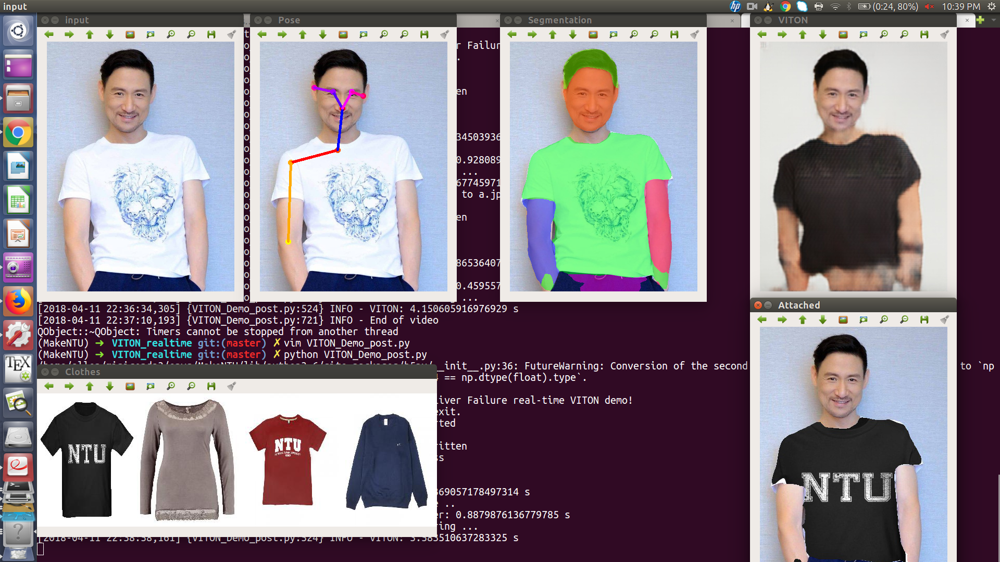
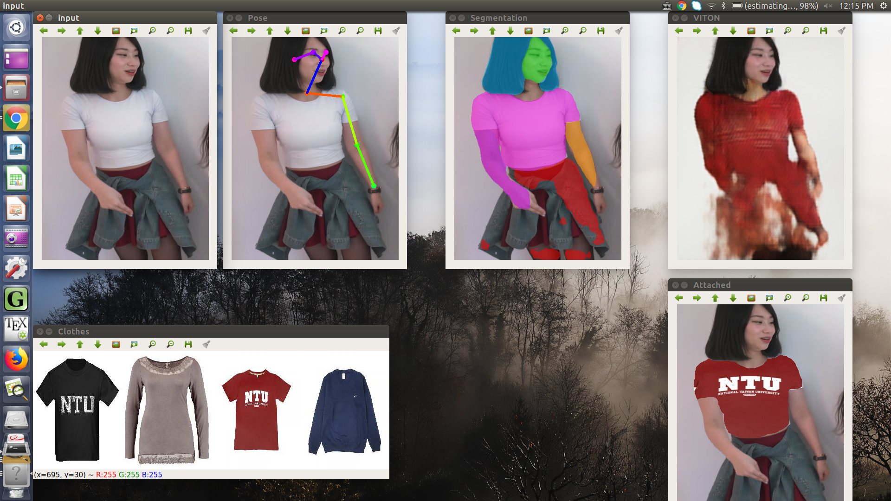

# VITON Real-time

Real time virtual try-on for 2018 Make NTU

## What did we do?

We made a clothes vendor machine that has virtual try-on feature. Here we just demostrate the software part.

Three models (pose / segmentation / VITON) and five threads (read frame / pose / segment / VITON / display & control) are used in this demo program. It's a bit tricky to make it real-time (and MakeNTU is just a 24-hour event!).

Segmentation inference requires heavy GPU calculation and Python threading has some problem dealing with mulitple tensorflow programs, so I wrote API servers to separate those parts from threads in the main program.

By doing so, five threads could do their tasks respectively. If you could get a smaller segmentation network or powerful GPU, real-time virtual try-on with VITON is possible. For now only frame reading is real-time, while other processes need to be triggered by keyboard control. 

The virtual try-on part is based on [VITON: An Image-based Virtual Try-on Network](https://github.com/xthan/VITON)
, code and dataset for the CVPR 2018 paper "VITON: An Image-based Virtual Try-on Network"

The human parser is based on [SS-NAN](https://github.com/llltttppp/SS-NAN)

The pose estimator is based on [tf-pose-estimation](https://github.com/ildoonet/tf-pose-estimation)

**Note: the tf-pose-estimation is not as good as Openpose!! It often fails to detect some easy cases.**

## Results



<sub>**Fig 1 & 2** 
Input: original input image; 
Pose: detected pose (it's not good because of using tf-pose-estimation); 
Segmentation: human parser result; 
VTION: VITON result based on pose and segmentation and given clothes; 
Attached: algorithm we developed to paste clothes on original picture using segmentation result; 
Clothes: given clothes to try on.
Input image is cropped from [here](https://www.facebook.com/139558289414447/photos/a.153087201394889.28055.139558289414447/1129802803723319/?type=1&theater) and [here](https://www.youtube.com/watch?v=b4mzZaEliZU&feature=youtu.be)</sub>

[Demo video](https://youtu.be/21y2Ly9FVl0)


## How to run?

1. Download related models
* Download pretrained SS-NAN model [here](https://pan.baidu.com/s/1nvMMl0P). Put AttResnet101FCN_lip_0023.h5 under SS-NAN/ folder.
* Model of tf-pose-estimation is already in the repo since it could use mobile-net.
* Download pretrained VITON models on [Google Drive](https://drive.google.com/drive/folders/1qFU4KmvnEr4CwEFXQZS_6Ebw5dPJAE21). Put them under model/ folder.

2. For remote server with GPU support, run the below for API server to deal with pose and segmentation inferrence:
```
conda env create -f environment.yml
source activate MakeNTU
bash run_API_server.sh
```

3. For local server, run the below to do VITON inferrence and avoid tensorflow session problem for concurrency:
```
conda env create -f environment.yml
source activate MakeNTU
export FLASK_APP=VITON_local_server.py
flask run
```

4. Change settings in VITON_Demo_post:
Set VIDEO_SOURCE to your webcam number or video path.

5. Finally, run the main app:
```
export SEG_SERVER=<IP address ofthe remote server, like http://192.168.0.123:8000>
export POSE_SERVER=<IP address ofthe remote server, like http://192.168.0.123:8000>
export VITON_SERVER='http://localhost:5000'
source activate MakeNTU
python VITON_Demo_post.py
```

Keyboard controls

```
q: to exit
c: to capture image and do virtual try-on
a/s/d/f: change clothes to try on
```

Other files are for running all things locally or without concurrency.

One could also run `python post_viton.py` to run without local VITON server.

## Authors

* **Ya-Liang Chang** - *All servers / clients, CNNs and demo apps*  [amjltc295](https://github.com/amjltc295)

* **Hsi-Sheng Mei** - *Attach clothes algorithm* - [jasonoscar88](https://github.com/jasonoscar88)

* **albert18711** - *Control / PPT*

* **KU-MING Wang** - *Hardware*

# The below are from the original repo.

The original repo uses matlab script instead of end-to-end network.

This repo does not implement the second stage of the original repo.

### Person representation extraction
The person representation used in this paper are extracted by a 2D pose estimator and a human parser:
* [Realtime Multi-Person Pose Estimation](https://github.com/ZheC/Realtime_Multi-Person_Pose_Estimation)
* [Self-supervised Structure-sensitive Learning](https://github.com/Engineering-Course/LIP_SSL)

### Dataset

The dataset can be downloaded on [Google Drive](https://drive.google.com/drive/folders/1-RIcmjQKTqsf3PZsoHT4hivNngx_3386?usp=sharing).

This dataset is crawled from women's tops on [Zalando](https://www.zalando.co.uk/womens-clothing-tops/). These images can be downloaded on Google Drive. The results of pose estimation and human parsing are also included. Note that number of the images/poses/segmentation maps are more than that reported in the paper, since the ones with bad pose estimations (too few keypoints are detected) or parsing results (parsed upper clothes regions only occupy a small portion of the image).

Put all folder and labels in the `data` folder:

`data/women_top`: reference images (image name is ID_0.jpg) and clothing images (image name is ID_1.jpg). For example, the clothing image on reference image 000001_0.jpg is 000001_1.jpg. The resolution of these images is 1100x762.

`data/pose.pkl`: a pickle file containing a dictionary of the pose keypoints of each reference image. Please refer to [this demo](https://github.com/ZheC/Realtime_Multi-Person_Pose_Estimation/blob/master/testing/python/demo.ipynb) for how to parse the stored results, and [OpenPose output] https://github.com/CMU-Perceptual-Computing-Lab/openpose/blob/master/doc/output.md) to understand the output format.

`data/pose/`: folder containing the pose keypoints of each reference image.

`data/segment`: folder containing the segmentation map of each reference image. In a segmentation map, label 5 corresponds to the regions of tops (used as pseudo ground truth of clothing region). label 1 (hat), 2 (hair), 4 (sunglasses), and 13 (face) are merged as the face/hair representation. All other non-background regions are merged for extracting the body representation. The colormap for visualization can be downloaded [here](https://github.com/Engineering-Course/LIP_SSL/blob/master/human_colormap.mat). Due to padding operations of the parser, these segmentation maps are 641x641, you need to crop them based on the aspect ratio of the original reference images.

`data/tps/`: TPS control points between product image and its corresponding reference image.

`data/viton_train_images.txt`: training image list.

`data/viton_train_pairs.txt`: 14,221 reference image and clothing training image pairs.

`data/viton_test_pairs.txt`: 2,032 reference image and target clothing testing image pairs. Note that these pairs are only used for the evaluation in our paper, one can choose any reference image and target clothing to generate the virtual try-on results.

### Test

#### First stage
Download pretrained models on [Google Drive](https://drive.google.com/drive/folders/1qFU4KmvnEr4CwEFXQZS_6Ebw5dPJAE21?usp=sharing). Put them under `model/` folder.

Run `test_stage1.sh` to do the inference.
The results are in `results/stage1/images/`. `results/stage1/index.html` visualizes the results.

#### Second stage

Run the matlab script `shape_context_warp.m` to extract the TPS transformation control points.

Then `test_stage2.sh` will do the refinement and generate the final results, which locates in `results/stage2/images/`. `results/stage2/index.html` visualizes the results.


### Train

#### Prepare data
Go inside `prepare_data`. 

First run `extract_tps.m`. This will take sometime, you can try run it in parallel or directly download the pre-computed TPS control points via Google Drive and put them in `data/tps/`.

Then run `./preprocess_viton.sh`, and the generated TF records will be in `prepare_data/tfrecord`.


#### First stage
Run `train_stage1.sh`

#### Second stage
Run `train_stage2.sh`


<!---
### Todo list
- [x] Code of testing the first stage.
- [x] Data preparation code.
- [x] Code of training the first stage.
- [x] Shape context matching and warping.
- [x] Code of testing the second stage.
- [x] Code of training the second stage.
-->

### Citation

If this code or dataset helps your research, please cite our paper:
`

    @inproceedings{han2017viton,
      title = {VITON: An Image-based Virtual Try-on Network},
      author = {Han, Xintong and Wu, Zuxuan and Wu, Zhe and Yu, Ruichi and Davis, Larry S},
      booktitle = {CVPR},
      year  = {2018},
    }
